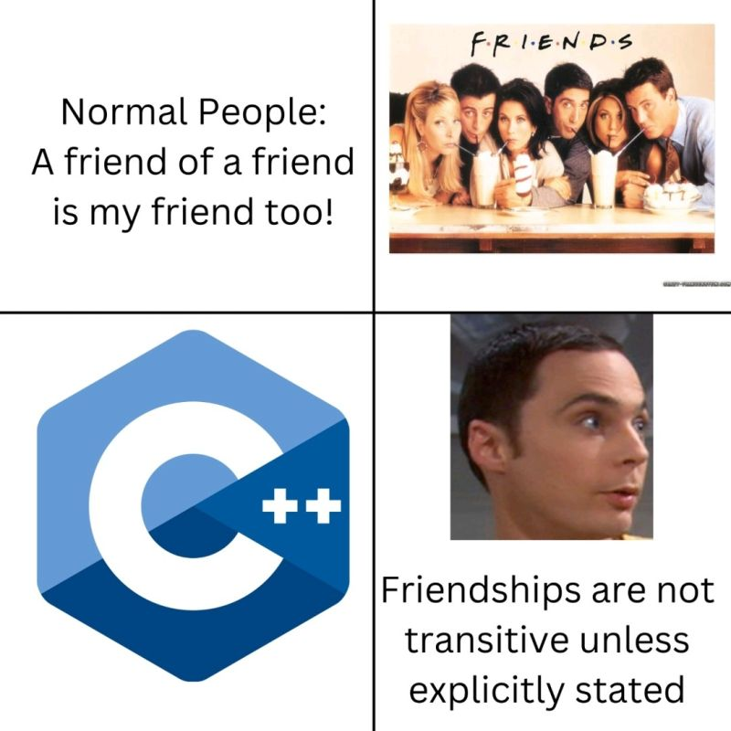

<h1 align="center">
<strong>AUT_AP_2024_Spring Homework 4</strong>
</h1>

<p align="center">
<strong> Deadline: 4th of Khordad - 23:59 o'clock</strong>
</p>

# Mastering Object-Oriented Programming and STL

## Overview

This homework is structured to deepen your understanding and mastery of modern C++ programming through hands-on application of advanced concepts. It is divided into two main parts, each focusing on crucial aspects of C++ development: object-oriented programming (OOP) and the Standard Template Library (STL).

## Objectives

The primary goals of this homework are:

1. **Reinforce OOP Concepts**: Enhance your knowledge of classes, inheritance, polymorphism, and other OOP principles.
2. **Master STL Operations**: Gain proficiency in using STL algorithms and functions, emphasizing loop-free programming techniques.

## Part 1: Classes and OOP in C++

The first part of the homework focuses on the design and implementation of a messaging system using various classes:

- **Base and Derived Classes**: Implement a base `Message` class and derived classes such as `TextMessage` and `VoiceMessage`.
- **User and Server Interactions**: Develop `User` and `Server` classes that manage messaging interactions, utilizing OOP principles like encapsulation, inheritance, and polymorphism.
- **Secure Communication**: Incorporate basic cryptography for secure message exchanges, applying practical security considerations in software design.

### Key Learning Outcomes:

- Understand and apply the concepts of class design and object management.
- Utilize inheritance and polymorphism to extend base class functionality in a meaningful way.
- Implement and manage class relationships and interactions to simulate a real-world application.

## Part 2: Focusing on STL

The second part of the homework shifts focus to the STL, emphasizing functional programming approaches within C++:

- **STL Algorithms**: Implement tasks using specific STL algorithms such as `std::transform`, `std::copy_if`, `std::generate`, and more.
- **No-Loop Programming**: Emphasize the use of STL to perform operations traditionally handled by loops, promoting more efficient and potentially more performant solutions.
- **Lambda Expressions**: Practice using lambda expressions to create concise and flexible code blocks for STL operations.

---

# `Message` Class

## Overview

The `Message` class is a foundational component of the messenger system you will develop. This class will serve as the base class for different types of messages (text messages, voice messages).

## Class Header

```cpp
class Message {
public:
    // Constructors
    Message(std::string type, std::string sender, std::string receiver);
    Message();

    // Getter functions
    std::string get_type() const;
    std::string get_sender() const;
    std::string get_receiver() const;
    std::string get_time() const;

    // Print function for use in operator<< overloading
    void print(std::ostream &os) const;

    // Overload operator<< to work with Message objects
    friend std::ostream& operator<<(std::ostream &os, const Message &msg);

private:
    std::string type;     // Type of the message ("text", "voice", ...)
    std::string sender;   // The username who sent this message
    std::string receiver; // The username to whom this message is intended
    std::string time;     // Creation time of the message in GMT
};
```

## Member Variables

- `type`: Indicates the type of message (e.g., "text", "voice").
- `sender`: Username of the user who sent the message.
- `receiver`: Username of the recipient.
- `time`: Timestamp of when the message was created, formatted as `"Mon May 13 17:50:43 2024"`. This should be automatically set during message creation using the `ctime` library.

## Constructors

- **Parameterized Constructor**: Initializes `type`, `sender`, and `receiver` with the provided values. `time` should be automatically set to the current GMT time using `ctime`.
- **Default Constructor**: Utilizes constructor delegation to assign default values and set the current GMT time.

## Member Functions

### Getter Functions

- Implement getter functions for each private member variable (`get_type()`, `get_sender()`, `get_receiver()`, `get_time()`). These functions should be `const` to ensure they do not modify the object.

### Print Function

- `void print(std::ostream &os) const`: A const member function that accepts a reference to an `ostream` object. It outputs the message's details in a structured format:
  ```
  *************************
  sender -> receiver
  message type: type
  message time: time
  *************************
  ```

### Operator Overloading

- `std::ostream& operator<<(std::ostream &os, const Message &msg)`: Overload the stream insertion operator to print `Message` objects using the `print` function. This operator should be a friend of the class to access private members.

---

# `TextMessage` Class

## Overview

The `TextMessage` class extends the `Message` class to specifically handle text messages. This class demonstrates how to use inheritance in C++ to build on existing functionality and add specialized behavior.

## Class Header

```cpp
#ifndef TEXT_MESSAGE_H
#define TEXT_MESSAGE_H

#include "Message.h"  // Include the base class header
#include <string>
#include <iostream>

class TextMessage : public Message {
public:
    // Constructor
    TextMessage(std::string text, std::string sender, std::string receiver);

    // Member function for printing
    void print(std::ostream &os) const;

    // Getter function for the text content
    std::string get_text() const;

private:
    std::string text;  // The text content of the message
};

#endif // TEXT_MESSAGE_H
```

## Member Variable

- `text`: Stores the actual text content of the message.

## Constructor

- **TextMessage Constructor**: Initializes the `Message` part of the object using the base class constructor and sets the `text` member with the provided string. It takes `text`, `sender`, and `receiver` as parameters, forwarding `sender` and `receiver` to the `Message` constructor.

## Member Functions

### Print Function

- `void print(std::ostream &os) const`: This function should override the base class's `print` function. It should output the message's details, including the text content, in a structured format:
  ```
  *************************
  sender -> receiver
  message type: text
  message time: time
  text: text content
  *************************
  ```
  Ensure that this function aligns with the formatting established in the base class and properly utilizes the base class's functionality to avoid duplicating code.

### Getter Function

- `std::string get_text() const`: Returns the `text` member variable. This function should be `const` to guarantee that it does not modify the object.

## Discussion

**Note**: The `print` function should work seamlessly with the `operator<<` overload provided in the base class, ensuring that when a `TextMessage` object is streamed, the correct format is displayed. This is an example of polymorphism where the base class pointer or reference can use the derived class's print function.

---

# `VoiceMessage` Class

## Overview

The `VoiceMessage` class is an extension of the `Message` class and is tailored to manage voice data as messages.

## Class Header

```cpp
#ifndef VOICE_MESSAGE_H
#define VOICE_MESSAGE_H

#include "Message.h"  // Include the base class header
#include <vector>
#include <string>
#include <iostream>

class VoiceMessage : public Message {
public:
    // Constructor
    VoiceMessage(std::string sender, std::string receiver);

    // Member function for printing
    void print(std::ostream &os) const;

    // Getter function for the voice data
    std::vector<unsigned char> get_voice() const;

private:
    std::vector<unsigned char> voice; // Array of bytes to store the voice data
};

#endif // VOICE_MESSAGE_H
```

## Member Variable

- `voice`: A vector of `unsigned char`, storing the voice data as an array of bytes. For simplicity, it is always filled with 5 random bytes.

## Constructor

- **VoiceMessage Constructor**: Initializes the base part of the object (`Message` class) with the sender and receiver information. The `voice` vector is then filled with 5 random bytes. This demonstrates basic data manipulation and storage within an object.

## Member Functions

### Print Function

- `void print(std::ostream &os) const`: This function should override the base class's `print` function. It should output the details of the `VoiceMessage`, including the voice data in a readable format:
  ```
  *************************
  sender -> receiver
  message type: voice
  message time: time
  voice: 166 240 216 41 129
  *************************
  ```
  The bytes in the `voice` vector are displayed as integers to provide clarity. The function should correctly format the voice data for display.

### Getter Function

- `std::vector<unsigned char> get_voice() const`: Returns the `voice` member variable. This function should be `const` to ensure it does not modify the object.

## Discussion Point

**Note**: The `print` function should seamlessly integrate with the `operator<<` overload provided in the base class, demonstrating polymorphism by using the derived class's print function when a `VoiceMessage` object is streamed.

---

# `User` Class

## Overview

The `User` class represents users in the messenger system. Users can send text and voice messages to each other through a server. Security is a priority, and thus RSA keys are used for encryption (**Encryption function are ALREADY implemented 🫡**)

## Class Header

```cpp
#ifndef USER_H
#define USER_H

#include "Server.h"  // Assume Server class is defined elsewhere
#include <string>

class User {
public:
    // Constructor
    User(std::string username, std::string private_key, Server* server);

    // Getter for username
    std::string get_username() const;

    // Functions to send messages
    bool send_text_message(std::string text, std::string receiver);
    bool send_voice_message(std::string receiver);

private:
    std::string username;      // Username of the user
    std::string private_key;   // Private RSA key of the user
    Server* const server;      // Pointer to the server for communications
};

#endif // USER_H
```

## Member Variables

- `username`: Identifies the user within the system.
- `private_key`: The user's private RSA key used for encryption.
- `server`: A pointer to the server object used for sending and managing messages.

## Constructor

- **User Constructor**: Initializes the `username`, `private_key`, and `server`. This setup ensures that each user is linked to a specific server for message handling and has the necessary credentials for secure communication.

## Member Functions

### Getter Function

- `std::string get_username() const`: Returns the username of the user. This function is `const` because it does not modify any member variables.

### Message Sending Functions

- `bool send_text_message(std::string text, std::string receiver)`: Allows the user to send a text message to another user specified by `receiver`. The function constructs a text message and uses the server's `create_message` function to handle it. Returns `true` if the message is successfully sent, `false` otherwise.

- `bool send_voice_message(std::string receiver)`: Allows the user to send a voice message, which contains random data of 5 bytes, to the specified receiver. This function also uses the server's `create_message` function to process the message. Returns `true` if the message is successfully sent, `false` otherwise.

## Discussion Point

**Note**: Ensure that the use of the server's `create_message` function is clear and properly explained in the class where this function is defined. Understanding how messages are created and managed by the server is crucial for implementing these functions correctly.

---

# `Server` Class

## Overview

The `Server` class is responsible for managing users and messages in the messaging system. It stores user details, their RSA keys, and the messages exchanged between them. This class demonstrates the implementation of secure communications and efficient data management without using traditional loops, leveraging modern C++ techniques and STL functions.

## Class Header

```cpp
#ifndef SERVER_H
#define SERVER_H

#include "User.h"
#include "Message.h"
#include <vector>
#include <map>
#include <string>

class Server {
public:
    // Default constructor
    Server();

    // Getter functions
    std::vector<User> get_users() const;
    std::map<std::string, std::string> get_public_keys() const;
    std::vector<Message*> get_messages() const;

    // User and message management
    User create_user(std::string username);
    bool create_message(Message* msg, std::string signature);

    // Message retrieval
    std::vector<Message*> get_all_messages_from(std::string username);
    std::vector<Message*> get_all_messages_to(std::string username);
    std::vector<Message*> get_chat(std::string user1, std::string user2);

    // Utility functions
    void sort_msgs(std::vector<Message*> msgs);

private:
    std::vector<User> users;                        // Stores all users
    std::map<std::string, std::string> public_keys; // Maps usernames to their public keys
    std::vector<Message*> messages;                 // Stores all messages sent by users
};

#endif // SERVER_H
```

## Constructor

- **Default Constructor**: Initializes the server object. No specific actions are required upon instantiation beyond default initialization of member variables.

## Member Functions

### Getter Functions

- These functions provide read-only access to the server's internal data structures:
  - `std::vector<User> get_users() const`
  - `std::map<std::string, std::string> get_public_keys() const`
  - `std::vector<Message*> get_messages() const`

### User and Message Management

- **create_user**: Creates a new user with the specified username. This function checks if the username already exists and throws `std::logic_error` if it does. It also handles RSA key generation for each new user.
- **create_message**: Adds a message to the server after verifying the sender's signature. This function ensures that messages are authenticated before being stored.

### Message Retrieval Functions

- These functions retrieve messages based on different criteria using STL algorithms and lambdas:
  - `std::vector<Message*> get_all_messages_from(std::string username)`
  - `std::vector<Message*> get_all_messages_to(std::string username)`
  - `std::vector<Message*> get_chat(std::string user1, std::string user2)`

### Utility Functions

- **sort_msgs**: Sorts a list of messages by their creation time. This function uses STL's sort algorithm.

## Cryptography Instructions

- **RSA Key Generation**:
  ```cpp
  std::string public_key{}, private_key{};
  crypto::generate_key(public_key, private_key);
  ```
- **Signature Verification**:
  ```cpp
  std::string signature = crypto::signMessage(private_key, "my data");
  bool authentic = crypto::verifySignature(public_key, "my data", signature);
  ```

---

# STL Functions

## Overview

In this section of the homework, you are required to implement several functions in the `stl.h` file using standard template library (STL) algorithms and functions. The key requirement is to avoid traditional looping constructs such as `for` or `while` loops, and instead utilize the power of STL functions to accomplish these tasks.

## Functions to Implement

### 1. **Initial Vector with 3 Multiples**

Populate a vector with multiples of 3 (e.g., 3, 6, 9, ...) up to a specified size.

- **Function Signature**:
  ```cpp
  void initial_vector_with_3_multiples(std::vector<int>& v, size_t size);
  ```
- **Expected Behavior**: The function should fill the vector `v` with the first `size` multiples of 3.
- **Hints**:
  - Utilize `std::generate` to fill the vector. You can use a lambda function that captures a local variable to generate multiples of 3.

### 2. **Count Unique Above**

Count the unique elements in a vector that are greater than a given threshold `n`.

- **Function Signature**:
  ```cpp
  int count_unique_above(std::vector<int> v, int n);
  ```
- **Expected Behavior**: Return the count of unique elements that exceed the value `n`.
- **Hints**:
  - Consider using `std::set` to filter out duplicates and `std::count_if` to tally elements exceeding `n`.

### 3. **Vector to String**

Convert the contents of a vector into a string representation, with elements ordered backwards and separated by a specified character.

- **Function Signature**:
  ```cpp
  std::string vector_to_string(std::vector<int> v, char separator);
  ```
- **Expected Behavior**: Produce a string that contains the vector's elements in reverse order, separated by `separator`.
- **Hints**:
  - `std::accumulate` can be used effectively here along with `std::reverse` to manage the order and concatenation of elements.
    Certainly! Here are two additional tasks for your students, designed to teach them about `std::transform` and `std::copy`. These tasks will help them understand how to apply these STL functions in practical scenarios.

### 4. **Square the Elements**

Apply a transformation to each element of a vector by squaring its value.

- **Function Signature**:
  ```cpp
  void square_elements(std::vector<int>& v);
  ```
- **Expected Behavior**: This function should modify the vector `v` by squaring each of its elements.
- **Hints**:
  - Use `std::transform` with a lambda function that takes an element and returns its square.
  - This task will help you understand how to apply operations over a range without explicitly iterating through the vector.

### 5. **Copy If Even**

Copy only the even elements from one vector to another.

- **Function Signature**:
  ```cpp
  void copy_if_even(const std::vector<int>& source, std::vector<int>& destination);
  ```
- **Expected Behavior**: Extract even numbers from the `source` vector and store them in the `destination` vector.
- **Hints**:
  - Use `std::copy_if` to select and copy elements. You will need a lambda function to check if an element is even.
  - This task demonstrates how to selectively copy elements using conditions, enhancing your ability to manage data between containers.

These tasks should be a valuable addition to your homework, guiding students through the practical use of `std::transform` and `std::copy_if`. If you need further elaboration or additional tasks, feel free to ask!

## General Guidance

- **Avoid Loops**: Implement these functions using STL algorithms to practice more functional programming approaches within C++.
- **Efficiency**: While focusing on not using loops, also consider the efficiency of your STL usage, which can often offer more optimized solutions than traditional looping in many cases.
- **Testing**: Make sure to test your functions with various inputs to ensure they handle edge cases and typical scenarios correctly.

## Conclusion

This exercise is designed to strengthen your familiarity with STL algorithms and encourage thinking about alternative ways to solve programming problems. By mastering these tools, you can write more concise and potentially more performant C++ code.

---

# **Final Step: How To Test Your Program**

If you want to debug your code, set the `if` statement to `true`. This will allow you to place your debugging code in the designated section. Once you're done with the debugging process, remember to set the `if` statement back to `false` to test your program using the provided `unit-test.cpp`.

Furthermore, whatever code you write should be implemented in the `message.cpp/h`, `serve.cpp/h`, `user.cpp/h`, and `stl.h` files. Please refrain from making any changes to other files in the project.

```cpp
#include <iostream>
#include <gtest/gtest.h>
#include "message.h"
#include "user.h"
#include "server.h"
#include "stl.h"


int main(int argc, char **argv)
{
    if (false) // make false to run unit-tests
    {
        // debug section

    }
    else
    {
        ::testing::InitGoogleTest(&argc, argv);
        std::cout << "RUNNING TESTS ..." << std::endl;
        int ret{RUN_ALL_TESTS()};
        if (!ret)
            std::cout << "<<<SUCCESS>>>" << std::endl;
        else
            std::cout << "FAILED" << std::endl;
    }
    return 0;
}
```

<p align="center">
  
</p>

**Best Regards, [Hamidi](https://github.com/smhamidi)**
